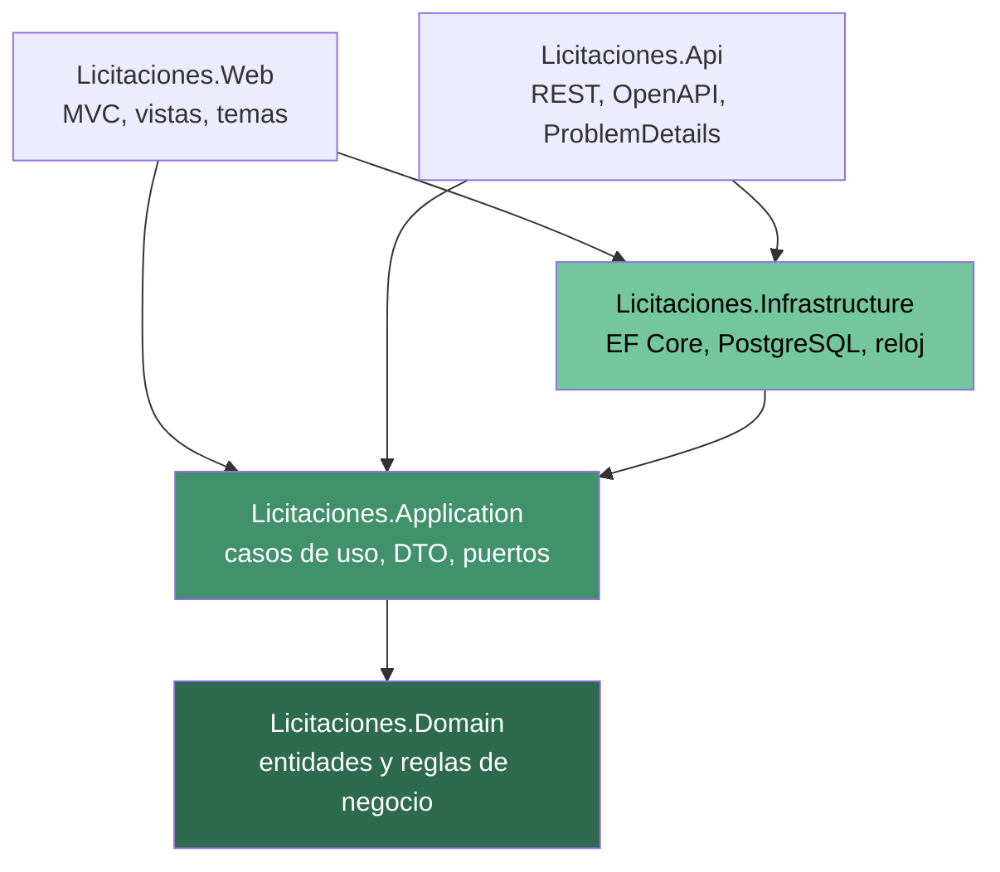

# Arquitectura general

## Decisión: monolito modular

La solución es un **monolito modular** (enunciado §6.3). No se eligieron
microservicios porque el sistema tiene un único modelo de dominio fuertemente
acoplado —una oferta no significa nada sin su licitación— y separarlo obligaría
a transacciones distribuidas para reglas que hoy resuelve una sola transacción de
PostgreSQL. El enunciado advierte explícitamente contra dividir el sistema para
aparentar complejidad.

## Capas y dirección de las dependencias



La regla es que **las dependencias apuntan hacia adentro**. `Domain` no conoce a
nadie; `Application` solo conoce a `Domain`; `Infrastructure` implementa las
interfaces que declara `Application`. Web y Api son detalles de entrega
intercambiables.

Esto se comprueba de forma objetiva: `Licitaciones.Domain.csproj` no tiene
ninguna `PackageReference`. Si alguien intentara usar Entity Framework Core
dentro de una entidad, el proyecto no compilaría.

## Responsabilidad de cada capa

| Proyecto | Contiene | No contiene |
|---|---|---|
| `Domain` | Entidades con sus invariantes, enumeraciones, servicios de dominio puros (`EvaluadorOfertas`, `TablaNivelesAprobacion`), `IReloj`, códigos de error. | Nada de infraestructura, ORM, HTTP ni DTO. |
| `Application` | Casos de uso, DTO, `Resultado<T>`, paginación, interfaces de repositorio (puertos). | Consultas SQL, atributos de EF Core, tipos de ASP.NET Core. |
| `Infrastructure` | `DbContext`, configuraciones, repositorios, migraciones, datos semilla, reloj del sistema. | Reglas de negocio. |
| `Web` / `Api` | Controladores delgados, vistas, contratos HTTP. | Lógica de negocio (enunciado §6.4). |

## Decisiones de diseño y su porqué

### Las entidades protegen sus invariantes

Las entidades tienen constructores privados y se crean con fábricas
(`Proveedor.Crear`, `Licitacion.Crear`, `Oferta.Registrar`). Las propiedades son
`private set`. Una entidad **no puede existir en estado inválido**: no hay forma
de construir una oferta con monto negativo ni de publicar una licitación vencida,
aunque se invoque el dominio desde una capa nueva que olvide validar.

Cuando una regla se infringe, la entidad lanza `ExcepcionDominio` con un código
estable. No es control de flujo por excepciones: es la forma de garantizar que la
regla no se pueda saltar. La capa de aplicación la captura en un único punto y la
convierte en `Resultado`.

### El error esperado es un valor, no una excepción

Los casos de uso devuelven `Resultado<T>`, que contiene o el valor o un
`ErrorAplicacion` con código, mensaje seguro y tipo. El tipo determina el código
HTTP:

| `TipoError` | HTTP | Ejemplo |
|---|---|---|
| `Validacion` | 400 | Nombre de proveedor con `@`. |
| `NoEncontrado` | 404 | Licitación inexistente. |
| `Conflicto` | 409 | Código de licitación repetido, oferta duplicada. |
| `Concurrencia` | 409 | Otro usuario editó el registro primero. |
| `ReglaNegocio` | 422 | Oferta superior al presupuesto, transición prohibida. |

La clasificación vive en `TraductorErrores`, en un solo sitio, para que la misma
regla produzca siempre el mismo código.

### El reloj se inyecta

`IReloj` abstrae la hora actual. Sin esto, probar que una oferta se rechaza
después del vencimiento exigiría esperas reales y produciría pruebas
intermitentes. Con el reloj falso, la prueba fija el instante y comprueba incluso
el caso límite: un *tick* antes del cierre se acepta, en el instante exacto se
rechaza.

### Sin colecciones de navegación en Licitación y Proveedor

`Licitacion` no expone `Ofertas`. Las ofertas se consultan por repositorio.

Esta decisión salió de una prueba que falló: `ObtenerMejorOfertaAsync` leía
`licitacion.Ofertas` y funcionaba solo si quien llamaba había usado `Include`.
Una colección que a veces está cargada y a veces no es una trampa silenciosa —
devuelve «sin ofertas válidas» en lugar de fallar. Se eliminó la navegación y la
dependencia se hizo explícita en el constructor del servicio. Queda registrado en
la [bitácora](bitacora-xp.md).

### La base de datos es la última línea de defensa

Toda regla de unicidad e integridad está **tres veces**: en el formulario, en el
servidor y en PostgreSQL (enunciado §8.3). La comprobación previa del servicio da
un mensaje claro; el índice único evita que dos peticiones simultáneas la burlen.
`UnidadDeTrabajo` traduce el error de PostgreSQL al mismo código que habría
devuelto la comprobación previa, así que el cliente recibe la misma respuesta gane
quien gane la carrera.

### Concurrencia optimista con `xmin`

Se usa la columna de sistema `xmin` de PostgreSQL como token de concurrencia, en
lugar de añadir una columna de versión propia. El enunciado §11 admite
explícitamente «un mecanismo equivalente de PostgreSQL». `xmin` la mantiene el
motor en cada `UPDATE`, sin código que pueda olvidar incrementarla.

## Estructura de carpetas

```
src/
  Licitaciones.Domain/          Common, Proveedores, Licitaciones, Ofertas, Aprobaciones, TiposCambio
  Licitaciones.Application/     Common, Abstracciones, y una carpeta por módulo
  Licitaciones.Infrastructure/  Persistencia (Configuraciones, Repositorios, Migraciones), Tiempo
  Licitaciones.Web/             pendiente: iteración 3
  Licitaciones.Api/             pendiente: iteración 3
tests/
  Licitaciones.UnitTests/       dominio y casos de uso con dobles en memoria
  Licitaciones.IntegrationTests/ PostgreSQL real con Testcontainers
  Licitaciones.FunctionalTests/ pendiente: iteración 4
```

## Configuración transversal

`Directory.Build.props` centraliza el marco de destino, `TreatWarningsAsErrors`,
`EnforceCodeStyleInBuild` y `AnalysisLevel`. Una advertencia rompe la compilación,
que es lo que hace verificable el requisito de «compilación sin advertencias
evitables» del §17.2. Las excepciones a las reglas de análisis están justificadas
una por una en `.editorconfig` y no desactivadas en bloque.
