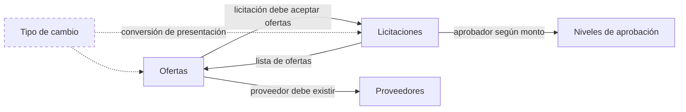
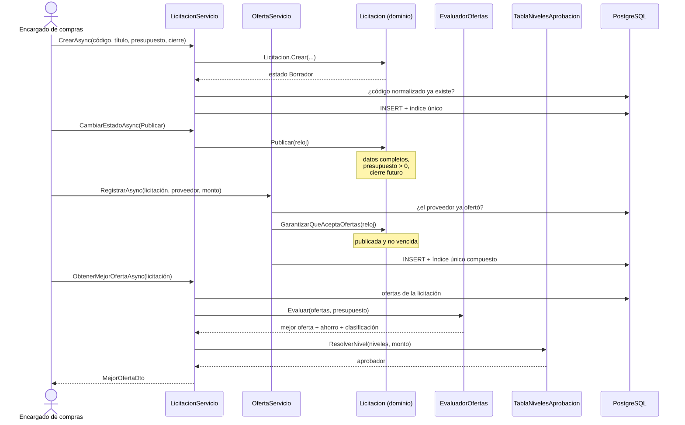
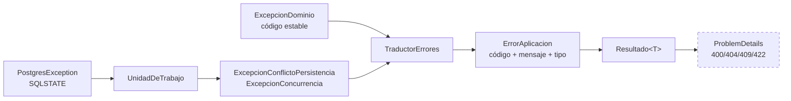

# Integración de módulos

Cómo cooperan los módulos y dónde están los límites entre ellos.

> **Estado.** Documenta las iteraciones 1 y 2 (dominio, aplicación y
> persistencia). Los flujos que pasan por la interfaz web y la API REST se
> añaden en las iteraciones 3 y 4; ver [plan-iteraciones-3-4.md](plan-iteraciones-3-4.md).

## Mapa de dependencias entre módulos

Las flechas continuas son dependencias reales de reglas de negocio. La discontinua
es de presentación: el tipo de cambio **nunca** altera un valor persistido.

## Límites y contratos

| Frontera | Contrato | Qué la atraviesa |
|---|---|---|
| Ofertas → Licitaciones | `Licitacion.GarantizarQueAceptaOfertas(reloj)` | Solo la decisión «admite cambios o no». Ofertas no interpreta estados por su cuenta. |
| Licitaciones → Ofertas | `IOfertaRepositorio.ListarPorLicitacionAsync` | Una lista de ofertas ya cargada. Licitaciones no consulta la base directamente. |
| Licitaciones → Niveles | `TablaNivelesAprobacion.ResolverNivel(niveles, monto)` | Un monto entra, un aprobador sale. Licitaciones no conoce los rangos. |
| Application → Infrastructure | Interfaces en `Abstracciones/Repositorios.cs` | Nada de EF Core cruza esta frontera. |

La regla que mantiene esto sano: **un módulo nunca reimplementa la regla de otro**.
Ofertas no comprueba si la fecha de cierre pasó comparando fechas; le pregunta a
la licitación.

## Flujo de extremo a extremo: adjudicar una licitación

## Dónde se detiene cada validación

Una misma regla se comprueba en varios puntos, con propósitos distintos:

| Nivel | Propósito | Ejemplo: nombre de proveedor duplicado |
|---|---|---|
| Formulario (pendiente) | Respuesta inmediata sin ida y vuelta | Aviso al salir del campo |
| Caso de uso | Mensaje claro y código estable | `ExisteNombreAsync` → `PROVEEDOR_NOMBRE_DUPLICADO` |
| Dominio | La entidad no puede quedar inválida | `Proveedor.Crear` valida caracteres |
| PostgreSQL | Última defensa ante concurrencia | `ix_proveedores_nombre_normalizado` |

El caso interesante es la **carrera**: dos peticiones simultáneas pueden pasar
ambas la comprobación del caso de uso. La segunda choca contra el índice único, y
`UnidadDeTrabajo` traduce ese error de PostgreSQL **al mismo código** que habría
devuelto la comprobación previa. El cliente recibe la misma respuesta gane quien
gane, sin ver nunca un error 500.

## Ciclo de vida de un error

El último paso está pendiente (iteración 3, HU-13): la API traduce `TipoError` al
código HTTP. La correspondencia está fijada en
[arquitectura-general.md](arquitectura-general.md) y ya se prueba en la capa de
aplicación, así que el controlador solo tendrá que mapear.

## Qué falta conectar

| Flujo | Iteración | Depende de |
|---|---|---|
| Formularios MVC → casos de uso | 3 | HU-11, HU-12 |
| Endpoints REST → casos de uso | 3 | HU-13 |
| Alternancia CRC/USD en la vista | 3 | HU-09, HU-10 |
| Verificación de extremo a extremo | 4 | HU-17 |

Los casos de uso ya devuelven todo lo que esas capas necesitan; el trabajo
pendiente es de presentación, no de reglas.
