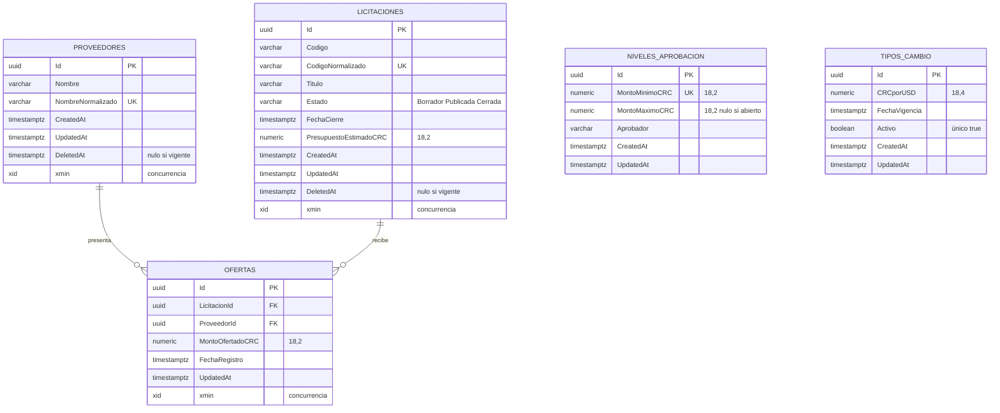

# Modelo de datos

Persistencia exclusiva en **PostgreSQL 16** con Entity Framework Core 9. SQLite
no sustituye a PostgreSQL ni en la aplicación ni en las pruebas de integración
(enunciado §11).

## Diagrama entidad-relación



## Decisiones de tipos

| Decisión | Motivo |
|---|---|
| Identificadores `uuid` v7 generados por la aplicación | Se generan automáticamente y no son editables (§7). La versión 7 incorpora marca temporal, así que las inserciones mantienen la localidad del índice, a diferencia de un `uuid` v4 aleatorio. |
| Montos `numeric(18,2)` | Exigido por §7. Queda prohibido `float`/`double`, que no representan de forma exacta valores decimales y acumulan error al sumar dinero. |
| Tipo de cambio `numeric(18,4)` | Se cotiza con más precisión que un monto; redondearlo a dos decimales distorsionaría conversiones grandes. |
| Fechas `timestamptz` desde `DateTimeOffset` | Se comparan en UTC y se presentan en `America/Costa_Rica` (§8.2). |
| `Estado` como texto y no como entero | Una migración que reordene el `enum` no puede corromper datos existentes, y las consultas manuales son legibles. |

## Índices y restricciones

| Nombre | Tabla | Tipo | Qué garantiza |
|---|---|---|---|
| `ix_proveedores_nombre_normalizado` | proveedores | Único parcial `WHERE DeletedAt IS NULL` | Nombre único ignorando mayúsculas, espacios y forma Unicode. Es parcial para poder reutilizar el nombre tras una baja lógica. |
| `ix_licitaciones_codigo_normalizado` | licitaciones | Único parcial `WHERE DeletedAt IS NULL` | Código único ignorando espacios laterales y mayúsculas. |
| `ix_licitaciones_estado` | licitaciones | Índice | Acelera el listado filtrado por estado. |
| `ix_ofertas_licitacion_proveedor` | ofertas | **Único compuesto** | Un proveedor no puede ofertar dos veces en la misma licitación (§8.3). |
| `ix_ofertas_licitacion_monto` | ofertas | Índice compuesto | La mejor oferta se busca por monto ascendente dentro de una licitación. |
| `ix_niveles_aprobacion_minimo` | niveles_aprobacion | Único | Dos rangos no pueden iniciar en el mismo monto. |
| `ix_tipos_cambio_activo_unico` | tipos_cambio | Único parcial `WHERE Activo = true` | Solo un tipo de cambio activo (§8.8), impuesto por el motor y no por la aplicación. |
| `ck_licitaciones_presupuesto_positivo` | licitaciones | CHECK | Presupuesto > 0. |
| `ck_ofertas_monto_positivo` | ofertas | CHECK | Monto > 0. |
| `ck_niveles_minimo_positivo` | niveles_aprobacion | CHECK | Monto mínimo > 0. |
| `ck_niveles_rango_coherente` | niveles_aprobacion | CHECK | Máximo nulo o mayor que el mínimo. |
| `ck_tipos_cambio_positivo` | tipos_cambio | CHECK | Tipo de cambio > 0. |
| `FK_ofertas_licitaciones_LicitacionId` | ofertas | FK `RESTRICT` | Impide borrar físicamente una licitación con ofertas (§8.9). |
| `FK_ofertas_proveedores_ProveedorId` | ofertas | FK `RESTRICT` | Impide borrar físicamente un proveedor con ofertas. |

Las restricciones CHECK se verifican con SQL crudo en las pruebas de integración,
saltándose el dominio a propósito, para comprobar que la base de datos rechaza el
dato aunque la aplicación fallara.

## Borrado lógico

Proveedores y licitaciones tienen `DeletedAt`. La política, implementada en los
casos de uso:

- **Sin ofertas relacionadas** → borrado físico. No hay evidencia que conservar.
- **Con ofertas relacionadas** → borrado lógico. Las ofertas se conservan como
  evidencia (§8.9) y el registro deja de aparecer en los listados ordinarios.

Las ofertas no tienen borrado lógico: se eliminan físicamente mientras la
licitación siga publicada y vigente, y dejan de poder eliminarse en cuanto cierra.

## Auditoría y concurrencia

Todas las tablas llevan `CreatedAt` y `UpdatedAt` en UTC, escritos por el dominio
a través de `IReloj` y no por la base de datos, para que las pruebas puedan fijar
el instante.

`ofertas`, `licitaciones` y `proveedores` usan `xmin` como token de concurrencia
optimista, tal como exige §7 para esas tres entidades. Si dos usuarios editan el
mismo registro, el segundo `SaveChanges` lanza `DbUpdateConcurrencyException`,
que `UnidadDeTrabajo` traduce a `ExcepcionConcurrencia` y el caso de uso a un
error `Concurrencia` → HTTP 409. Verificado en
`PersistenciaTests.ConcurrenciaOptimista_DetectaLaEdicionSimultaneaDeUnProveedor`.

## Migraciones y datos semilla

Migración inicial: `20260813042242_MigracionInicial`.

```bash
dotnet dotnet-ef migrations add NombreDeLaMigracion --project src/Licitaciones.Infrastructure --output-dir Persistencia/Migraciones
```

Los datos semilla se insertan con código (`DatosSemilla.SembrarAsync`) y no con
`HasData`, porque las entidades se crean por fábrica y así los datos iniciales
pasan por las mismas validaciones que cualquier alta. La operación es idempotente:
puede ejecutarse en cada arranque sin duplicar.

Contenido sembrado:

| Tabla | Datos |
|---|---|
| `niveles_aprobacion` | 0,01–999 999,99 → Encargado de área · 1 000 000,00–9 999 999,99 → Gerencia · 10 000 000,00–sin límite → Junta Directiva |
| `tipos_cambio` | Un registro activo con 520,00 CRC por USD, administrable desde la aplicación |

Los estados no requieren tabla semilla: son un `enum` persistido como texto.

## Cadena de conexión

Nunca se versiona una credencial real (§11). La cadena se toma de la variable de
entorno `LICITACIONES_CONNECTION`; el valor de respaldo de
`FabricaDbContextDisenio` apunta a la base local de desarrollo y existe solo para
que las herramientas de línea de comandos puedan generar migraciones sin
conectarse a nada real.
