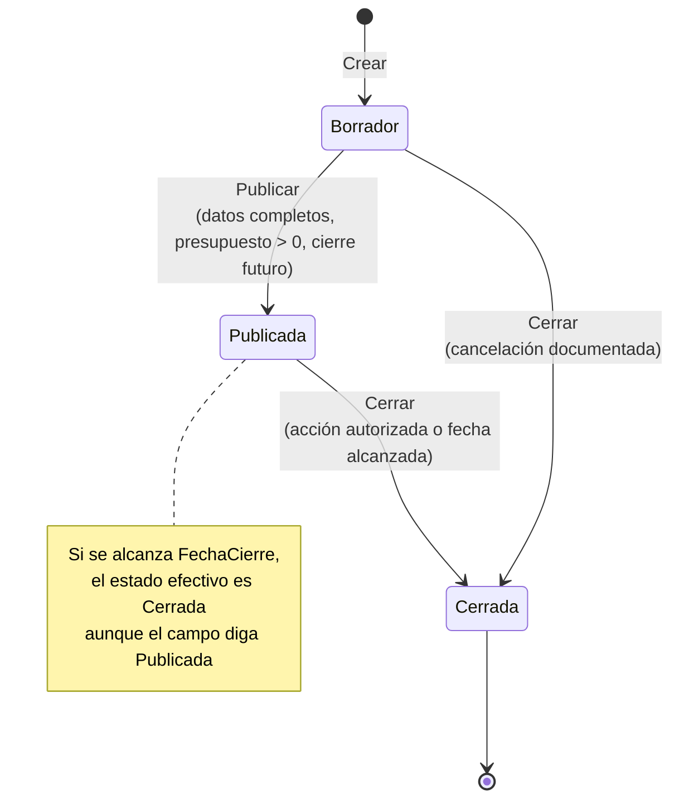

# Módulo: Licitaciones

Historias cubiertas: **HU-03** (crear licitación), **HU-04** (publicar y cerrar) y
**HU-07** (mejor oferta y clasificación).

## Propósito

Gestionar la convocatoria: código único, presupuesto en colones, fecha de cierre
y el ciclo de estados que determina cuándo se admiten ofertas.

## Ciclo de estados (§8.1)



Transiciones **prohibidas**: `Publicada → Borrador` y cualquier salida desde
`Cerrada`. Ambas producen `LICITACION_TRANSICION_INVALIDA`.

### Estado registrado frente a estado efectivo

Es la sutileza central del módulo. El enunciado §8.1 dice que una licitación cuya
fecha de cierre se alcanzó «se considera cerrada funcionalmente, aunque una
actualización tardía del campo de estado todavía indique Publicada».

Se resuelve con dos conceptos separados:

| Concepto | Qué es |
|---|---|
| `Estado` | El campo persistido. Cambia solo con una transición explícita. |
| `EstadoEfectivo(reloj)` | El estado real. Devuelve `Cerrada` si `Estado == Publicada` y ya se alcanzó `FechaCierre`. |

Todas las reglas operativas (`AceptaOfertas`, edición) usan el **efectivo**. Así
el sistema se comporta correctamente sin necesidad de un proceso que recorra la
tabla actualizando estados, que sería una fuente de inconsistencias.

## Reglas de presupuesto (§8.5)

- Mayor que cero, `numeric(18,2)`.
- **No puede reducirse por debajo de una oferta ya registrada.** El monto de la
  mayor oferta se pasa como parámetro explícito a `ActualizarDatos`, no se lee de
  una colección de navegación: así la regla no depende de que el ORM haya cargado
  los datos relacionados.

## Unicidad del código (§8.3)

Único ignorando espacios laterales y mayúsculas: `"lic-2026-001"` y
`"  LIC-2026-001  "` son el mismo código. Se valida en el servidor y con el índice
único parcial `ix_licitaciones_codigo_normalizado`.

## Mejor oferta y clasificación (§8.6)

```
Porcentaje de ahorro = ((Presupuesto − Mejor oferta) / Presupuesto) × 100
```

| Condición | Clasificación |
|---|---|
| Sin ofertas | «Sin ofertas válidas» |
| Ahorro ≥ 10 % | «Oferta conveniente» |
| 0 % < ahorro < 10 % | «Oferta aceptable» |
| Ahorro = 0 % (oferta igual al presupuesto) | «Oferta válida sin ahorro» |

La mejor oferta es la de **menor monto**; en empate gana la **registrada
primero**. El identificador desempata el caso extremo de dos ofertas con marca
temporal idéntica, para que el resultado sea siempre determinista.

El cálculo vive en `EvaluadorOfertas`, una función pura sobre datos ya cargados:
no consulta la base de datos y se prueba por completo con pruebas unitarias.

La consulta devuelve además el **aprobador** que corresponde al monto, resuelto
por la tabla de [niveles de aprobación](niveles-aprobacion.md).

## Errores

| Código | Tipo | HTTP |
|---|---|---|
| `LICITACION_CODIGO_VACIO` / `LICITACION_TITULO_VACIO` | Validación | 400 |
| `LICITACION_PRESUPUESTO_NO_POSITIVO` | Validación | 400 |
| `LICITACION_CODIGO_DUPLICADO` | Conflicto | 409 |
| `LICITACION_PRESUPUESTO_MENOR_QUE_OFERTA` | Regla de negocio | 422 |
| `LICITACION_FECHA_CIERRE_NO_FUTURA` | Regla de negocio | 422 |
| `LICITACION_TRANSICION_INVALIDA` | Regla de negocio | 422 |
| `LICITACION_CERRADA_NO_MODIFICABLE` | Regla de negocio | 422 |
| `LICITACION_NO_ENCONTRADA` | No encontrado | 404 |

## Pruebas

- `LicitacionTests` — transiciones válidas y prohibidas, vencimiento en el
  instante exacto, presupuesto frente a ofertas existentes.
- `EvaluadorOfertasTests` — mejor oferta, desempate, umbrales de clasificación.
- `CasosDeUsoTests` / `ConsultasYPaginacionTests` — código único, mejor oferta con
  aprobador, borrado físico frente a lógico.
- `PersistenciaTests` — índice único real, clave foránea con ofertas.
